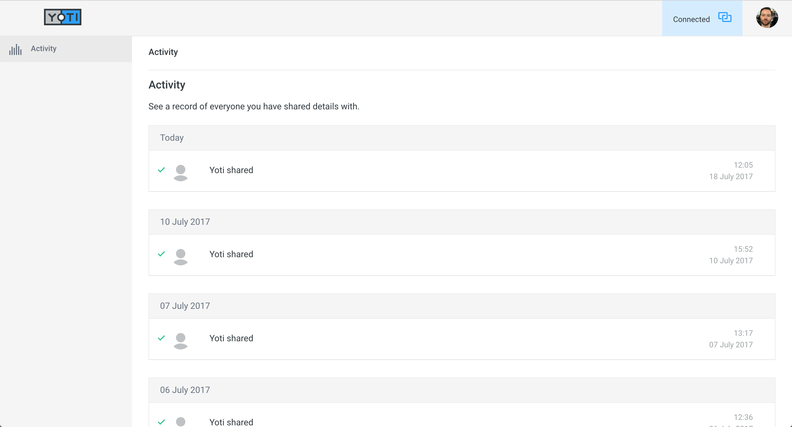
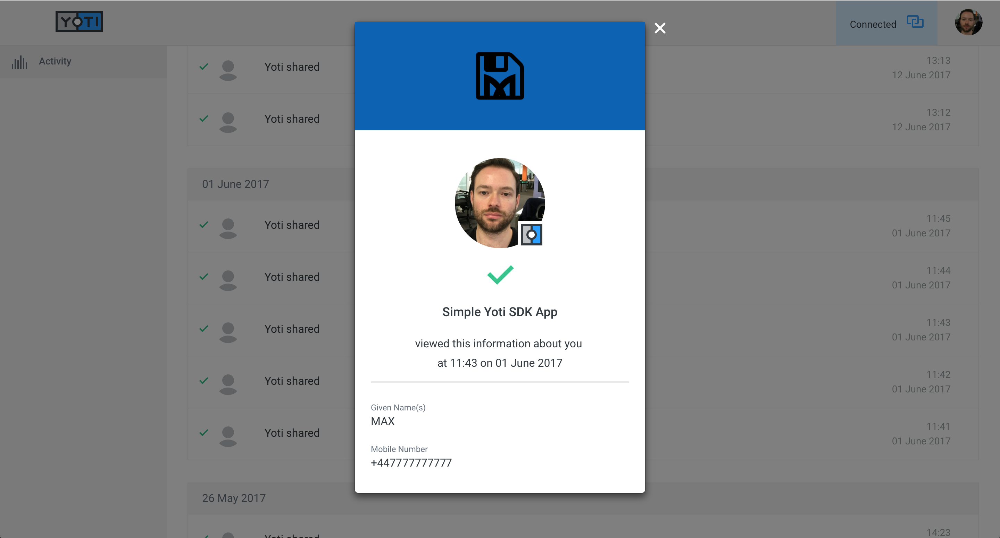
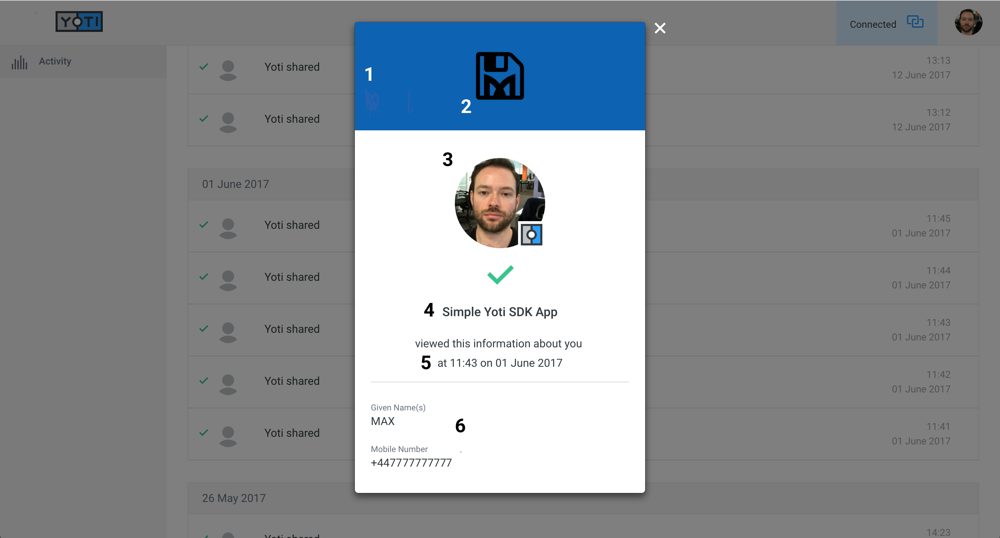

# Yoti Front End Developer Code Test
___

*Your time is valuable - please try not to spend more than a day working on this exercise.*

### The Task

- Create a replica of the [Yoti Dashboard Activity Page](https://www.yoti.com/dashboard) which displays receipts of the logged in user's actions *(see Activity Page Image)*.
- Receipts should be grouped by date and ordered chronologically.
- Upon clicking on a receipt, a modal should display more detailed information *(see Activity Modal Image)*.
- Users may dismiss the modal by either clicking outside the modal body, or on the **X** icon.
- See below for test prerequisites and tech requirements.

*Activity Page*

*Activity Modal*

### Prerequisites

- Use React/Angular (or as specified) and SCSS.
- Use either Webpack / Gulp (or an alternative task runner) for local development.
- Must consume data from `mock-data.json` file only.

### Data Structure

`mock-data.json` contains an array of receipts - either from transactions with a Yoti Application or by sharing details with another Yoti user.

*Activity Modal Annotated*

1: Application `bg-color`.

2: Application `bg-logo` - *applications may or may not have a logo*.

*NB*: If the receipt is of type `share`, the section containing `1` and `2` is hidden.

3: Selfie - if receipt is of type `application` this is the logged in user's selfie - use an image of your choosing in this case. If selfie is not a requested attribute of a `share` type receipt, it defaults to a placeholder image (again, use an image of your choosing).

4: Application name - if the receipt is not an application this should read `Yoti Shared` and `viewed this information about you` is hidden.

5: Timestamp.

6: Attributes section - details of which personal attributes have been shared.

### Assets

A spritesheet has been provided in the `assets` directory.

The relevant classes are `icon-activity`, `icon-logo`, `icon-connect-on`, `icon-dismiss-light`, `icon-user-serlfie-ph-small`, `icon-logo-circle` and `icon-receipt-confirmed`.

Yoti has a styleguide and SCSS library which can be found [here](https://design.yoti.com)

Feel free to add some more mock data of your own to give the page some more content.